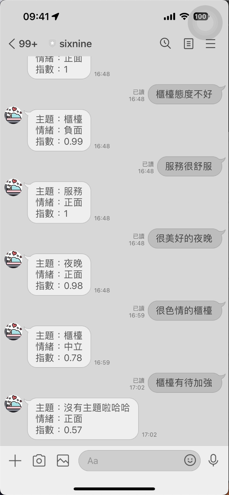

# 說明：
## 第一步：
將老師的程式碼照打下來，會回傳positive, negative, 或neutral

## 第二步：
將回傳的情緒翻譯成中文，並將情緒指數一併回傳<br>
新增以下程式碼：<br>
`const sentimentTextMap = {
        "positive": "正面",
        "negative": "負面",
        "neutral": "中立"
      };`<br>
並將text改成：<br>
``text:`情緒：${sentimentTextMap[sentimentText]}\n指數：${sentimentScore[highestSentiment]}`};``

## 第三步：
抓出主詞並且一起回傳<br>
新增以下程式碼：<br>
`const results = await analyticsClient.analyzeSentiment(documents, "zh-hant",{
        includeOpinionMining:true
    });`
    <br>
``let mainOpinions = results[0].sentences[0]?.opinions[0]?.target?.text;``
<br>
但有可能無法判斷主題，因此要將主題輸出undefined改成沒有主題哈哈：<br>
``if (mainOpinions === undefined) {
        mainOpinions = "沒有主題啦哈哈";
    }``<br>
並將text改成：<br>
```text:`主題：${mainOpinions}\n情緒：${sentimentTextMap[sentimentText]}\n指數：${sentimentScore[highestSentiment]}`}```

# 結果：

