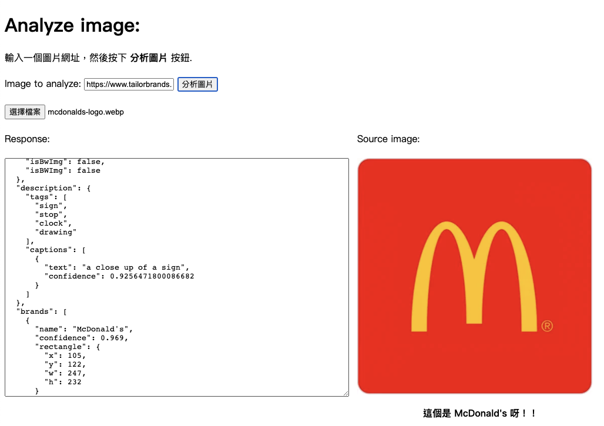
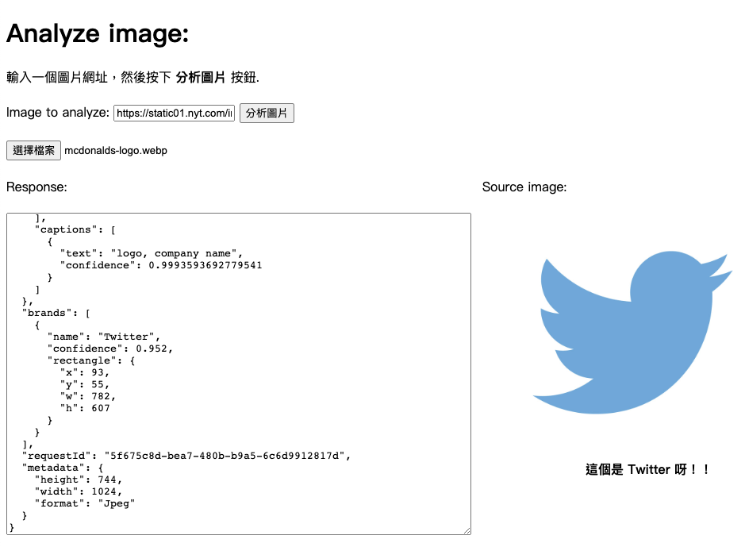
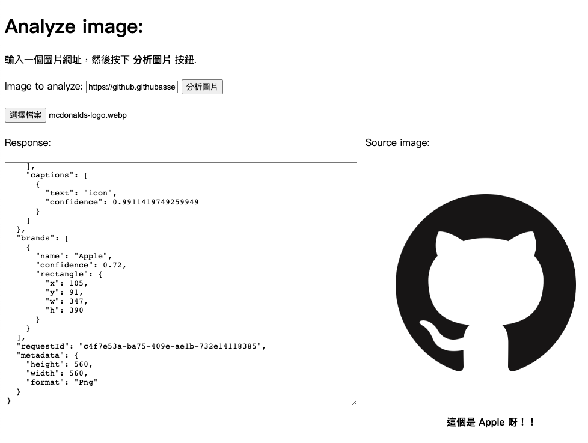
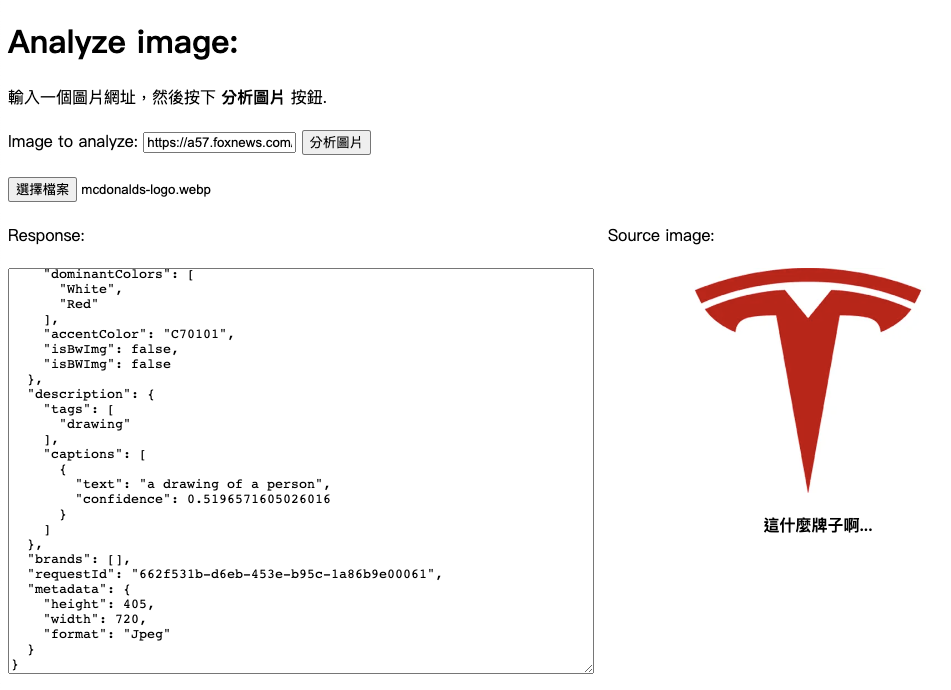
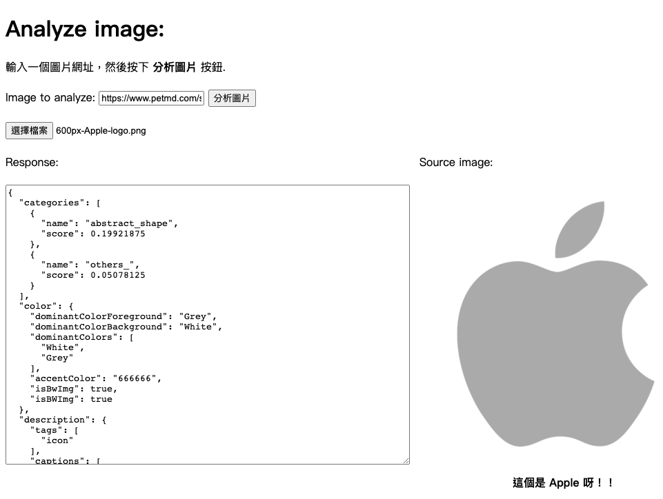

## 情境說明：
很多時候看到一個沒看過的LOGO，但又不知道怎麼查，這時候直接將所看到的LOGO拍下來直接查詢。 
 
如下圖所示⇣ 
 
 
 
但還是有可能會判斷錯啊😡
 
或是判斷不出來 
 
 
而以下從本地上傳檔案⇣ 
 

-------
## 程式碼說明：
在參數中加入Brands⇣ 
   ` var params = {
        "visualFeatures": "Categories,Description,Color,Brands",
        "details": "",
        "language": "en",
    };` 
     
    並在JSON顯示內容中加入判斷出來的品牌，但是有時候會判斷不出任何品牌，所以還要先判斷`brands[0].name`有沒有值，沒有的話就要輸出"這什麼牌子啊..." 
    `if (data.brands && data.brands.length > 0) {
            $("#picDescription").text("這個是 " + data.brands[0].name + " 呀！！");
        } else {
            $("#picDescription").text("這什麼牌子啊...");
        }`
